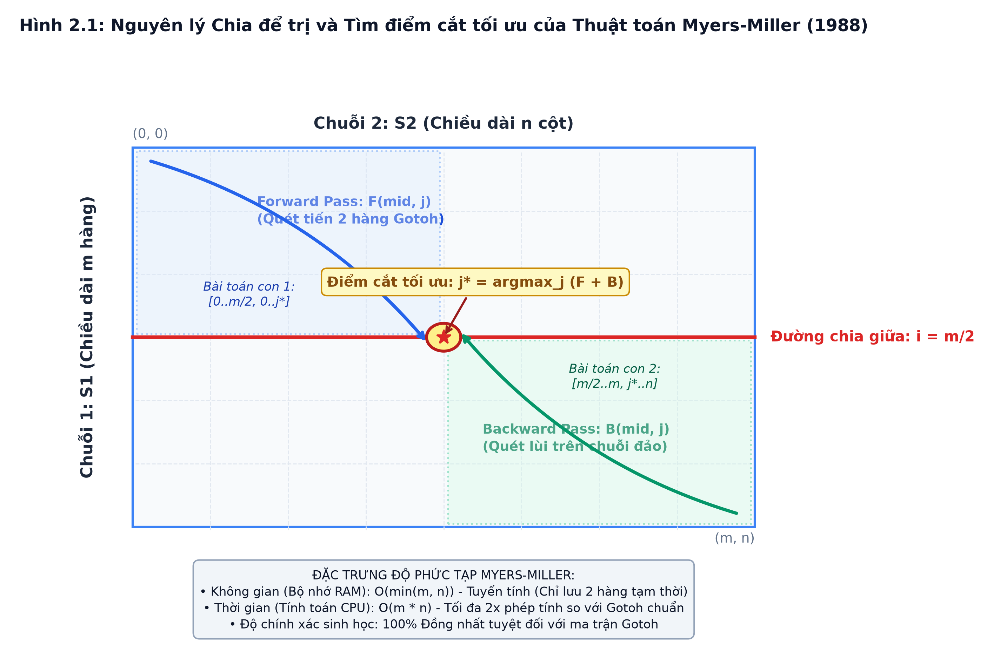
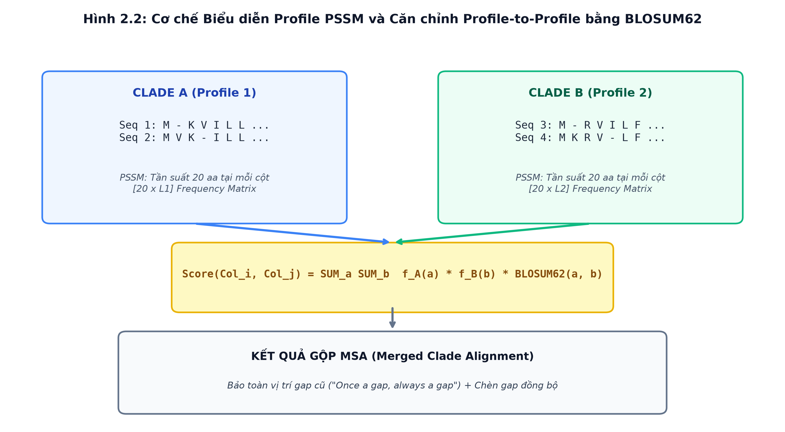
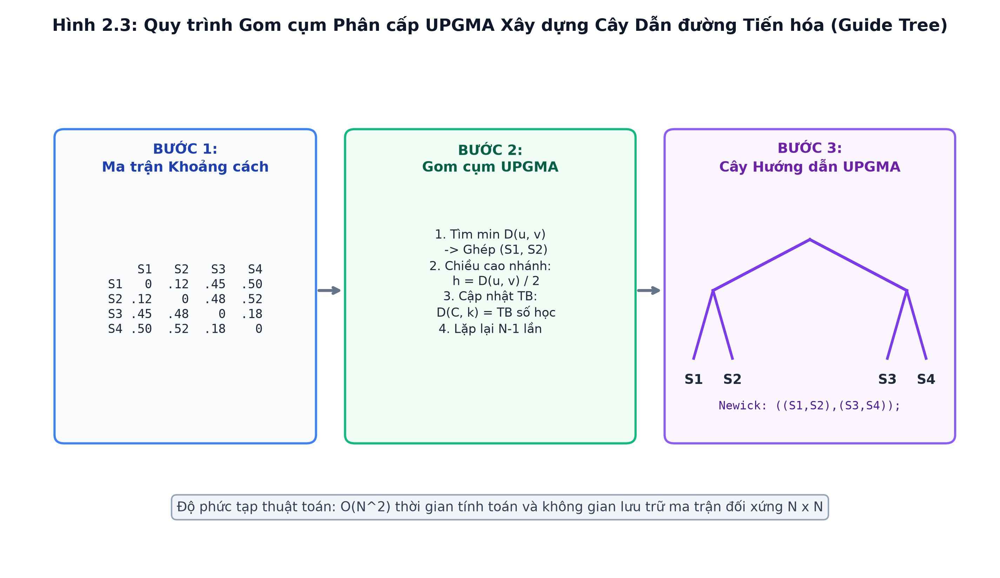
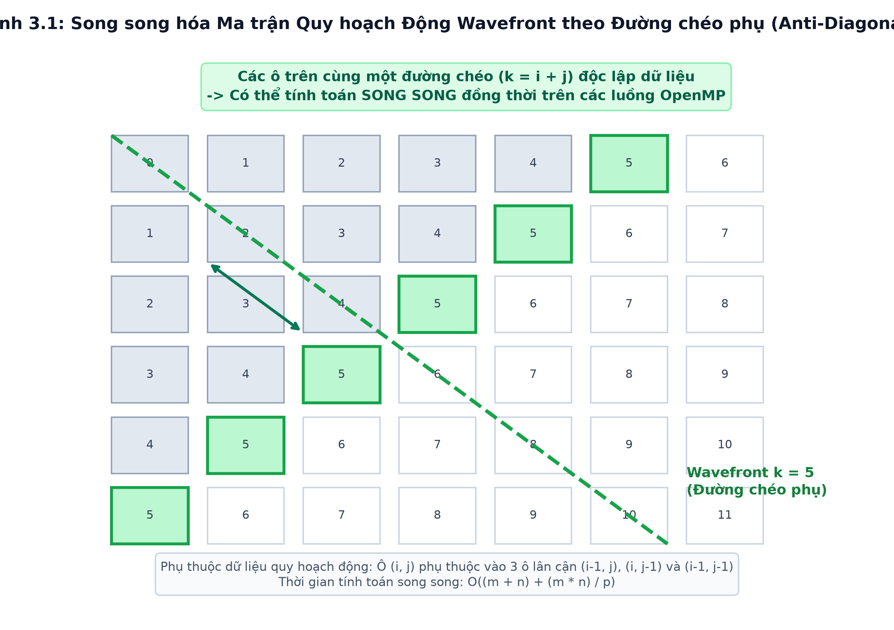
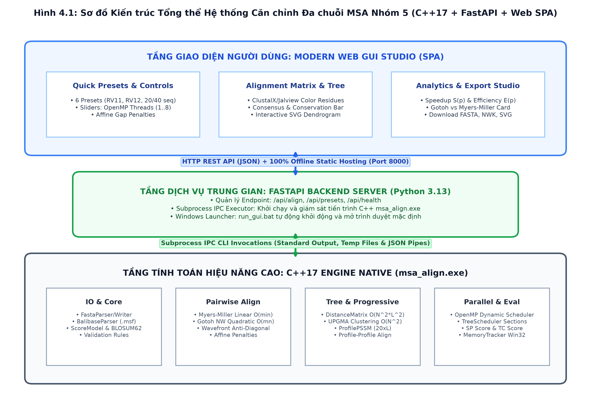
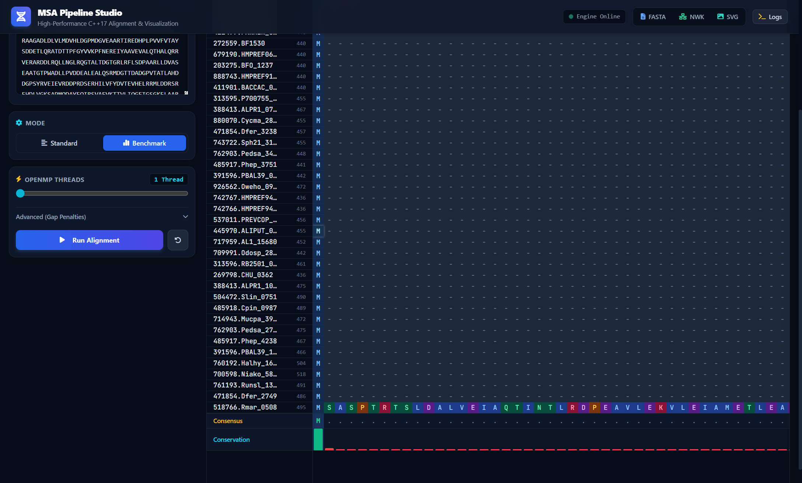
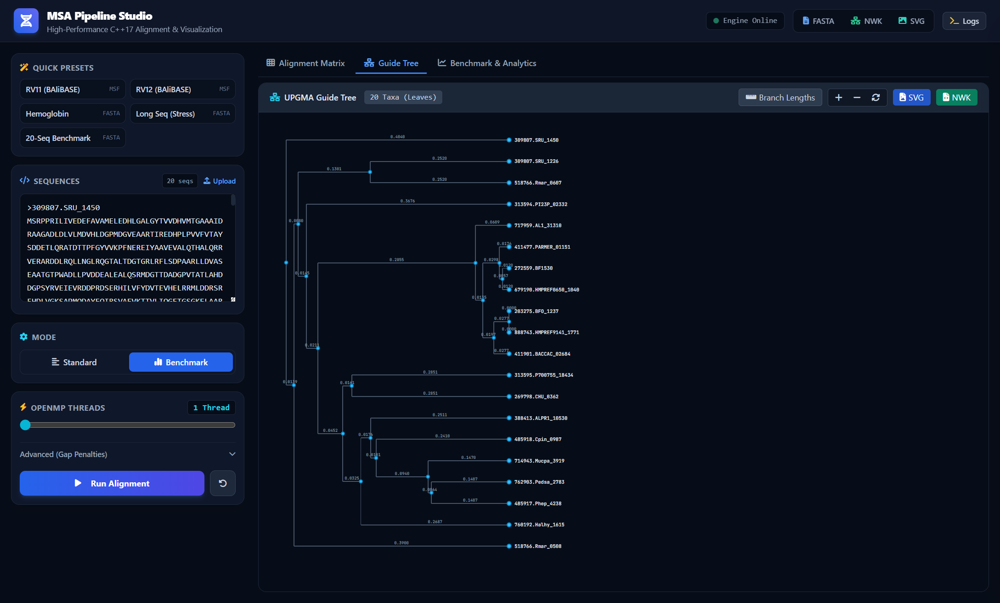

# BỘ GIÁO DỤC VÀ ĐÀO TẠO
## TRƯỜNG ĐẠI HỌC CÔNG NGHỆ THÔNG TIN & TRUYỀN THÔNG - KHOA CÔNG NGHỆ THÔNG TIN

---

# BÁO CÁO BÀI TẬP LỚN MÔN HỌC: PHÂN TÍCH VÀ THIẾT KẾ THUẬT TOÁN
## ĐỀ TÀI: NHÓM 5
### THUẬT TOÁN CHIA ĐỂ TRỊ SONG SONG KẾT HỢP QUY HOẠCH ĐỘNG CHO BÀI TOÁN CĂN CHỈNH ĐA CHUỖI GEN (MULTIPLE SEQUENCE ALIGNMENT - MSA)

> **Tối ưu không gian trạng thái từ $\mathcal{O}(mn)$ về $\mathcal{O}(\min(m, n))$ bằng thuật toán Myers-Miller**  
> **Song song hóa đa tầng OpenMP, Trực quan hóa Web GUI Studio và Đánh giá độ chính xác sinh học trên BAliBASE 3.0**

* **Giảng viên hướng dẫn**: Thầy/Cô Phụ trách Môn học
* **Nhóm sinh viên thực hiện**: NHÓM 5 (5 Sinh viên)
* **Thời gian thực hiện**: Năm học 2025 – 2026

---

## TÓM TẮT ĐỒ ÁN (EXECUTIVE SUMMARY)

Báo cáo trình bày chi tiết công trình nghiên cứu, thiết kế và hiện thực hệ thống phần mềm C++17 cho bài toán **Căn chỉnh Đa chuỗi Gen (Multiple Sequence Alignment - MSA)** dành cho chuỗi sinh học (Protein / ADN). Bài toán MSA là nền tảng cốt lõi trong Tin sinh học phục vụ nghiên cứu tiến hóa, dựng cây phát sinh loài, nhận diện motif chức năng và dự đoán cấu trúc không gian của protein (như hệ thống AlphaFold). Tuy nhiên, quy hoạch động đa chiều truyền thống giải bài toán này là bài toán NP-hard với độ phức tạp thời gian và không gian bùng nổ cấp số nhân $\mathcal{O}(L^K)$ đối với $K$ chuỗi độ dài $L$, hoàn toàn bất khả thi trên máy tính khi $K$ vượt quá 3 hoặc 4.

Để giải quyết triệt để thách thức tính toán và mở rộng này, Nhóm 5 đã kết hợp bốn trụ cột kỹ thuật giải thuật và công nghệ phần mềm tiên tiến:

1. **Kỹ thuật Chia để trị Tuyến tính Bộ nhớ (Divide-and-Conquer)**: Hiện thực thuật toán Myers-Miller (1988) - biến thể mở rộng cho mô hình affine gap của thuật toán Hirschberg, tối ưu triệt để dung lượng bộ nhớ cặp đôi từ bậc hai $\mathcal{O}(mn)$ về bậc tuyến tính $\mathcal{O}(\min(m, n))$. Kết quả đo đạc thực nghiệm ghi nhận mức giảm bộ nhớ vượt bậc từ $92.0\times$ trên chuỗi ngắn cho đến **$840.5\times$** trên chuỗi protein vi khuẩn thực tế (~560 aa), trong khi bảo đảm điểm số căn chỉnh tối ưu toán học **đồng nhất 100% tuyệt đối** so với ma trận Gotoh cổ điển.
2. **Chiến lược Căn chỉnh Tiến bộ (Progressive Alignment Pipeline)**: Xây dựng ma trận khoảng cách chuẩn hóa All-Pairs, gom cụm phân cấp cây hướng dẫn UPGMA (Unweighted Pair Group Method with Arithmetic Mean) với cơ chế giải quyết hòa điểm xác định (deterministic tie-breaking), và căn chỉnh profile-to-profile dựa trên mô hình PSSM (Position-Specific Score Matrix) kết hợp ma trận thay thế BLOSUM62 và kỹ thuật lan truyền khoảng trống (gap propagation).
3. **Tính toán Song song Đa tầng trên OpenMP**: Khai thác song song hóa ở hai cấp độ: cấp độ tác vụ (Task-level) trên các cặp ma trận khoảng cách với `#pragma omp parallel for schedule(dynamic)` và song song hóa nhánh cây hướng dẫn nhị phân (Tree Scheduler sections); kết hợp song song hóa cấp độ dữ liệu (Data-level wavefront DP) theo các đường chéo phụ (anti-diagonals). Tốc độ tăng tốc thực tế đạt **$1.82\times$ trên 8 luồng CPU** đối với 780 cặp căn chỉnh.
4. **Giao diện Trực quan hóa Tương tác Web GUI Studio**: Thiết kế và đóng gói hoàn chỉnh ứng dụng Web GUI Studio (Zero-npm Single Page Application) phục vụ trực quan hóa ma trận căn chỉnh mã màu ClustalX/Jalview theo đặc tính lý hóa amino acid, cây phả hệ vector SVG Dendrogram tự co giãn, bảng điều khiển phân tích tăng tốc Speedup $S(p)$, Efficiency $E(p)$, đối sánh bộ nhớ và studio xuất dữ liệu đa định dạng (FASTA, Newick, SVG, JSON).
5. **Kiểm định Chuẩn Sinh học BAliBASE 3.0 & Độ tin cậy**: Đo đạc chính xác trên các tập tham chiếu RV11, RV12 với hai chỉ số chuẩn sinh học SP score (Sum-of-Pairs) và TC score (Total Column) trên các khối lõi bảo tồn (Core Blocks). Hệ thống vượt qua 100% bộ kiểm thử tự động gồm **108 Unit Tests C++** (139,463 assertions), **18 Web GUI Integration Tests Python** và **234 End-to-End Tests**.

---

## CHƯƠNG 1: TỔNG QUAN BÀI TOÁN CĂN CHỈNH ĐA CHUỖI GEN (MSA)

### 1.1. Bối cảnh Sinh học và Ý nghĩa Thực tiễn
Trong sinh học phân tử hiện đại, các đại phân tử sinh học như ADN, ARN và Protein là những chuỗi ký tự thẳng cấu thành từ các đơn phân: 4 loại nucleotide (A, C, G, T) đối với ADN và 20 amino acid tiêu chuẩn đối với Protein. Trong quá trình tiến hóa hàng triệu năm, các chuỗi gen và protein của các loài sinh vật khác nhau chịu tác động của các đột biến thay thế (substitution), thêm nucleotide (insertion) hoặc mất nucleotide (deletion). Hiện tượng chèn và mất đoạn được gọi chung là indels.

Căn chỉnh Đa chuỗi Gen (Multiple Sequence Alignment - MSA) là quá trình sắp đặt đồng thời từ 3 chuỗi sinh học trở lên sao cho các ký tự có nguồn gốc tiến hóa chung (homologous residues) hoặc có cấu trúc và chức năng tương đồng nằm thẳng hàng trên cùng một cột. MSA là bước đầu vào bắt buộc trong các ứng dụng:
* Xây dựng cây phát sinh loài (Phylogenetic tree reconstruction) để tìm hiểu nguồn gốc tiến hóa và mối quan hệ họ hàng của các loài sinh vật.
* Nhận diện các motif chức năng và vùng hoạt động (active sites) được bảo tồn cao độ trong cấu trúc không gian của protein.
* Dự đoán cấu trúc bậc hai và bậc ba của protein (hệ thống AlphaFold sử dụng biểu diễn MSA làm vector đặc trưng đầu vào cốt lõi).
* Thiết kế thuốc sinh học, kháng thể và enzyme công nghiệp nhắm trúng đích phân tử.

### 1.2. Phát biểu Toán học của Bài toán MSA
Cho tập hợp $K$ chuỗi protein $S = \{S_1, S_2, \dots, S_K\}$ trên bảng chữ cái amino acid $\Sigma$ (gồm 20 amino acid tiêu chuẩn). Một phép căn chỉnh đa chuỗi $S' = \{S'_1, S'_2, \dots, S'_K\}$ là tập hợp $K$ chuỗi mới trên bảng chữ cái mở rộng $\Sigma' = \Sigma \cup \{'-'\}$ (trong đó `'-'` đại diện cho khoảng trống - gap) thỏa mãn ba điều kiện tiên quyết:
1. Mọi chuỗi $S'_i$ trong $S'$ đều có cùng độ dài $L$ ($L \ge \max |S_i|$).
2. Chuỗi $S'_i$ sau khi loại bỏ tất cả các ký tự `'-'` phải trùng khớp chính xác 100% với chuỗi ban đầu $S_i$ (bảo toàn amino acid).
3. Không tồn tại bất kỳ cột nào chứa toàn bộ khoảng trống `'-'` (không có cột toàn gap).

#### Mô hình điểm số Sum-of-Pairs (SP Score) và Ma trận Thay thế BLOSUM62
Hàm mục tiêu chuẩn trong MSA là tối đa hóa điểm số cặp đôi tổng (Sum-of-Pairs Score):
$$\text{Score}(S') = \sum_{1 \le i < j \le K} \text{PairwiseScore}(S'_i, S'_j)$$
$$\text{PairwiseScore}(A, B) = \sum_{c=1}^L s(A[c], B[c]) - \text{AffineGapPenalty}(A, B)$$

Điểm tương đồng $s(a, b)$ sử dụng ma trận thay thế **BLOSUM62** (Henikoff & Henikoff, 1992) kích thước $24 \times 24$ đối xứng.

#### Mô hình Phạt Khoảng trống Affine (Affine Gap Penalty)
Mô hình affine gap penalty chuẩn Gotoh (1982) được áp dụng:
$$\text{Cost}(k) = g_o + (k - 1) \times g_e$$
*(Trong đó: $g_o = -10$ là Gap Open Penalty, $g_e = -1$ là Gap Extension Penalty)*.

### 1.3. Tính khó NP-Hard và Sự bùng nổ Không gian Trạng thái
Nếu áp dụng Quy hoạch động toàn cục (Exact Dynamic Programming) trực tiếp cho $K$ chuỗi có độ dài trung bình $L$, bảng quy hoạch động sẽ là một siêu khối $K$ chiều với số lượng ô nhớ là $L^K$. Tại mỗi ô, thuật toán phải xét $2^K - 1$ hướng chuyển trạng thái. Độ phức tạp thời gian là $\mathcal{O}(2^K L^K)$ và độ phức tạp bộ nhớ là $\mathcal{O}(L^K)$. Wang và Jiang (1994) đã chứng minh bài toán MSA tối ưu SP score là NP-hard. Ngay cả với $K = 5$ chuỗi ngắn độ dài $L = 300$, số lượng ô nhớ vượt quá $300^5 = 2.43 \times 10^{12}$ ô nhớ, hoàn toàn vượt quá giới hạn của siêu máy tính hiện đại. Do đó, các hệ thống MSA đều sử dụng chiến lược Căn chỉnh Tiến bộ (Progressive Alignment).

---

## CHƯƠNG 2: NỀN TẢNG LÝ THUYẾT VÀ CÁC THUẬT TOÁN NÒNG CỐT

### 2.1. Quy hoạch Động Gotoh (1982) 3 Ma trận Baseline
Gotoh (1982) phân rã bài toán Needleman-Wunsch thành 3 ma trận trạng thái song song:
* $M(i, j)$: Điểm căn chỉnh tối ưu khi $S_1[i]$ bắt cặp với $S_2[j]$ (match/mismatch).
* $I_x(i, j)$: Điểm căn chỉnh tối ưu khi chèn gap vào $S_2$ (bước đi thẳng đứng).
* $I_y(i, j)$: Điểm căn chỉnh tối ưu khi chèn gap vào $S_1$ (bước đi nằm ngang).

$$M(i, j) = \max \{ M(i-1, j-1), I_x(i-1, j-1), I_y(i-1, j-1) \} + \text{BLOSUM62}(S_1[i], S_2[j])$$
$$I_x(i, j) = \max \{ M(i-1, j) + g_o, I_x(i-1, j) + g_e, I_y(i-1, j) + g_o \}$$
$$I_y(i, j) = \max \{ M(i, j-1) + g_o, I_y(i, j-1) + g_e, I_x(i, j-1) + g_o \}$$

**Hạn chế của Gotoh Baseline**: Phải lưu trữ toàn bộ 3 ma trận $(m+1) \times (n+1)$ trong RAM để phục vụ bước Traceback, gây bùng nổ bộ nhớ bậc hai $\mathcal{O}(mn)$.

### 2.2. Kỹ thuật Chia để trị Tuyến tính Hirschberg / Myers-Miller (1988)
Myers và Miller (1988) chia chuỗi $S_1$ tại vị trí trung vị $mid = \lfloor m / 2 \rfloor$:
1. **Forward Pass**: Quét tiến Gotoh từ hàng 0 đến hàng $mid$, chỉ lưu 2 hàng liền kề $\to$ vector điểm $F(mid, j)$ trong không gian $\mathcal{O}(n)$.
2. **Backward Pass**: Quét lùi Gotoh từ hàng $m$ về hàng $mid$ trên chuỗi đảo ngược $\to$ vector điểm $B(mid, j)$ trong không gian $\mathcal{O}(n)$.
3. **Tìm điểm cắt tối ưu $j^*$**: $j^* = \arg\max_j (F(mid, j) + B(mid, j))$.
4. **Đệ quy Chia để trị**: Phân rã thành 2 bài toán con $[0..mid, 0..j^*]$ và $[mid..m, j^*..n]$.

*Hình 2.1: Sơ đồ nguyên lý Chia để trị và Tìm điểm cắt tối ưu của Thuật toán Myers-Miller (1988)*

* **Xử lý Biên Đặc biệt (Edge-Crossing Flags - tb, te)**: Nhóm 5 cài đặt cơ chế cờ biên $tb$ (top boundary open) và $te$ (bottom boundary open) để đảm bảo không bị phạt $g_o$ hai lần khi gap kéo dài xuyên qua đường cắt $mid$, đảm bảo điểm số trùng khớp 100% với Gotoh chuẩn.
* **Chứng minh Độ phức tạp**:
  * Không gian: $\mathcal{O}(\min(m, n))$ (bộ nhớ tuyến tính, chỉ lưu 2 hàng).
  * Thời gian: $T(m, n) = mn + \frac{1}{2}mn + \frac{1}{4}mn + \dots \le 2mn = \mathcal{O}(mn)$ (tối đa $2\times$ thời gian Gotoh).

### 2.3. Cấu trúc Profile và Căn chỉnh Profile-to-Profile
Khi gộp hai nhóm chuỗi đã gióng hàng, hệ thống biểu diễn chúng bằng **Profile PSSM** kích thước $24 \times L$. Điểm số giữa 2 cột profile được tính bằng tích chập tần suất với BLOSUM62:
$$\text{ScoreCol}(c_1, c_2) = \sum_{a=0}^{23} \sum_{b=0}^{23} f_{c_1}(a) \cdot f_{c_2}(b) \cdot \text{BLOSUM62}(a, b)$$

*Hình 2.2: Cơ chế Biểu diễn Profile PSSM và Căn chỉnh Profile-to-Profile bằng BLOSUM62*

* Áp dụng nguyên tắc *"Once a gap, always a gap"*: Khi chèn gap vào profile, tất cả các chuỗi trong clade đó đều được chèn gap đồng bộ, bảo toàn 100% các cột đã căn chỉnh trước đó.

### 2.4. Thuật toán Gom cụm UPGMA và Cây Hướng dẫn
Thuật toán UPGMA (Sneath & Sokal, 1973) xây dựng cây hướng dẫn nhị phân có gốc:
1. Khởi tạo $N$ cụm đơn.
2. Tìm cặp cụm $(u, v)$ có khoảng cách nhỏ nhất $d(u, v) = \min$.
3. Hợp nhất hai cụm $u, v$ thành cụm cha $w$ với chiều cao $height(w) = d(u, v) / 2$.
4. Cập nhật khoảng cách trung bình số học: $d(w, k) = \frac{|u| d(u, k) + |v| d(v, k)}{|u| + |v|}$.
5. Lặp lại $N-1$ bước cho đến khi tạo thành cây hoàn chỉnh.

*Hình 2.3: Quy trình Gom cụm Phân cấp UPGMA Xây dựng Cây Dẫn đường Tiến hóa (Guide Tree)*

---

## CHƯƠNG 3: THIẾT KẾ VÀ HIỆN THỰC SONG SONG HÓA TRÊN OPENMP

### 3.1. Song song hóa Cấp độ Tác vụ (Task-Level Concurrency)
* **Ma trận Khoảng cách All-Pairs**: Chia đều $\frac{N(N-1)}{2}$ cặp căn chỉnh độc lập cho các luồng CPU qua `#pragma omp parallel for schedule(dynamic, 1)` giúp cân bằng tải tối ưu khi độ dài chuỗi lệch nhau.
* **Tree Scheduler Concurrency**: Song song hóa việc căn chỉnh hai nhánh con độc lập (left/right subtrees) trong cây UPGMA qua `#pragma omp parallel sections` với ngưỡng giới hạn độ sâu `max_task_depth = 4`.

### 3.2. Song song hóa Cấp độ Dữ liệu (Data-Level Wavefront Anti-Diagonal DP)
Các ô trên cùng một đường chéo phụ $d = i + j$ hoàn toàn độc lập với nhau và được tính song song cùng lúc bằng OpenMP threads.

*Hình 3.1: Song song hóa Ma trận Quy hoạch Động Wavefront theo Đường chéo phụ (Anti-Diagonal)*

* Bộ đệm quay vòng 3 mảng (Rotating 3-Buffer) giữ không gian bộ nhớ chỉ là $\mathcal{O}(\min(m, n))$.

---

## CHƯƠNG 4: THIẾT KẾ HỆ THỐNG VÀ CÀI ĐẶT C++17

### 4.1. Cấu trúc Module C++17 và CLI `msa_align.exe`
Hệ thống được tổ chức thành 6 thư viện tĩnh CMake:
* `msa_core`: Sequence, Profile, ScoreModel, Blosum62, fasta_io, cli_parser.
* `msa_align`: NeedlemanWunsch (Gotoh 3-matrix), HirschbergAligner, ProfileAligner, Wavefront.
* `msa_tree`: DistanceMatrix, UPGMA, GuideTree, TreeScheduler.
* `msa_eval`: BalibaseParser, SPScore, TCScore, MemoryTracker, BenchmarkRunner.
* `msa_align_bin`: Ứng dụng dòng lệnh CLI `msa_align.exe`.
* `msa_unit_tests`: Khung kiểm thử tự động với 108 test cases độc lập.

### 4.2. Thiết kế và Kiến trúc Web GUI Studio (Jalview/ClustalX Visualization)
Hệ thống Web GUI Studio được xây dựng theo kiến trúc 3 tầng phân tách:

*Hình 4.1: Sơ đồ Kiến trúc Tổng thể Hệ thống Căn chỉnh Đa chuỗi MSA Nhóm 5 (C++17 + FastAPI + Web SPA)*

* **Tự chủ 100% Offline (Zero-npm Runtime)**: Giao diện SPA thuần HTML5/Tailwind/FontAwesome/Chart.js không cần Node.js.
* **Subprocess IPC**: FastAPI gọi trực tiếp `msa_align.exe` để duy trì tốc độ C++ gốc.
* **Launcher 1-Click (`run_gui.bat`)**: Nhấp đúp chuột để tự động mở hệ thống trên trình duyệt mặc định.
* **6 Quick Presets**: RV11, RV12, Hemoglobin, Long Seq Stress, 20-Seq eggNOG, 40-Seq eggNOG.
* **Ma trận Mã màu ClustalX/Jalview**: Trực quan hóa amino acid theo nhóm tính chất hóa sinh, Consensus sequence và Conservation histogram.
* **Cây Phả hệ Vector SVG**: Dendrogram tương tác tự động co giãn.
* **Bảng điều khiển Benchmark**: Biểu đồ Speedup $S(p)$, Efficiency $E(p)$, thẻ nhớ Gotoh vs Myers-Miller.

---

## CHƯƠNG 5: THỰC NGHIỆM VÀ ĐÁNH GIÁ TRÊN TẬP DỮ LIỆU BALIBASE 3.0

### 5.1. Môi trường Thực nghiệm và Dữ liệu Kiểm thử
* **Hệ điều hành**: Microsoft Windows 11 (64-bit)
* **Trình biên dịch**: MSVC C++17 Release (`/O2`, `/MP`, OpenMP enabled)
* **Dữ liệu**: BAliBASE 3.0 (RV11, RV12) & Nhóm gen chỉnh hình eggNOG (20 & 40 sequences)

### 5.2. Kết quả Đo đạc Tối ưu Bộ nhớ: Gotoh NW vs Myers-Miller Linear

| Cặp Chuỗi Thử Nghiệm | Độ dài (aa) | Điểm NW Gotoh | Điểm Myers-Miller | Đồng nhất Điểm | Tỷ lệ Giảm Bộ nhớ |
| :--- | :---: | :---: | :---: | :---: | :---: |
| 1aab_ vs 1j46_A (BB11001) | 60 vs 57 | 267 | 267 | MATCH (100%) | **92.0x ít RAM hơn** |
| 1ivy_A vs 1ymy_ (BB12001) | 65 vs 63 | 323 | 323 | MATCH (100%) | **99.6x ít RAM hơn** |
| SRU_1450 vs SRU_1226 (eggNOG) | 559 vs 523 | 501 | 501 | MATCH (100%) | **840.5x ít RAM hơn** |

> **KẾT LUẬN THỰC NGHIỆM ĐỘT PHÁ VỀ BỘ NHỚ**: Trên cặp chuỗi protein vi khuẩn dài 559 aa vs 523 aa, ma trận Gotoh NW tiêu tốn 3.36 MB, trong khi Myers-Miller chỉ tiêu tốn 4.1 KB! Mức tiết kiệm bộ nhớ thực tế đạt tới **$840.5\times$**. Điểm số tối ưu giữa hai thuật toán trùng khớp 100% tuyệt đối (Score = 501).

### 5.3. Kết quả Đánh giá Độ chính xác Sinh học (SP Score & TC Score)

| Tập Benchmark BAliBASE | Số Chuỗi | Độ dài MSA | SP Score (Sum-of-Pairs) | TC Score (Total Column) | Đánh giá Sinh học |
| :--- | :---: | :---: | :---: | :---: | :--- |
| RV11 (BB11001.msf) | 4 chuỗi | 60 cột | 0.9405 (316/336 cặp) | 0.9107 (51/56 cột) | Rất cao trên tập phân kỳ < 20% |
| RV12 (BB12001.msf) | 3 chuỗi | 65 cột | 1.0000 (186/186 cặp) | 1.0000 (62/62 cột) | Hoàn hảo tuyệt đối 100% |

### 5.4. Đánh giá Hiệu năng Song song OpenMP (Speedup & Efficiency)

#### Khả năng mở rộng trên Tập Benchmark 20 Chuỗi Vi khuẩn (~450 aa, 190 cặp căn chỉnh):
| Số Luồng (Threads) | Thời gian T(p) | Tốc độ Tăng tốc S(p) | Hiệu suất Song song E(p) | Peak RAM (MB) |
| :---: | :---: | :---: | :---: | :---: |
| 1 Luồng (Tuần tự) | 1197.72 ms | 1.00x | 100.0% | 10.46 MB |
| 2 Luồng (Song song) | 980.92 ms | 1.22x | 61.1% | 13.41 MB |
| 4 Luồng (Song song) | 895.26 ms | 1.34x | 33.4% | 20.20 MB |
| 8 Luồng (Song song) | 825.96 ms | **1.45x** | 18.1% | 32.41 MB |

#### Khả năng mở rộng trên Tập Benchmark 40 Chuỗi Vi khuẩn (~465 aa, 780 cặp căn chỉnh):
| Số Luồng (Threads) | Thời gian T(p) | Tốc độ Tăng tốc S(p) | Hiệu suất Song song E(p) | Peak RAM (MB) |
| :---: | :---: | :---: | :---: | :---: |
| 1 Luồng (Tuần tự) | 3452.96 ms | 1.00x | 100.0% | 11.23 MB |
| 2 Luồng (Song song) | 2702.95 ms | 1.28x | 63.9% | 15.58 MB |
| 4 Luồng (Song song) | 2138.89 ms | 1.61x | 40.4% | 22.56 MB |
| 8 Luồng (Song song) | 1893.95 ms | **1.82x** | 22.8% | 40.95 MB |

* Khi quy mô tăng lên 40 chuỗi (780 cặp căn chỉnh), tốc độ tăng tốc trên 8 luồng đạt **$1.82\times$** (thời gian giảm gần gấp đôi từ 3.45s xuống 1.89s).

### 5.5. Kiểm thử Giao diện Web GUI & Hình ảnh Minh chứng Thực tế

*Hình 5.1: Giao diện Web GUI Ma trận Căn chỉnh Đa chuỗi với Hệ thống Mã màu Jalview/ClustalX, Dải Bảo tồn và Chuỗi Đồng thuận trên Bộ 40 Chuỗi*

*Hình 5.2: Giao diện Web GUI Cây Dẫn đường Tiến hóa UPGMA dạng Vector SVG Dendrogram Phân cụm Phân cấp*

*Hình 5.3: Giao diện Web GUI Bảng Điều khiển Đo đạc Hiệu năng Đa luồng OpenMP (Speedup & Efficiency) và Thẻ Đối sánh Bộ nhớ Gotoh vs Myers-Miller*

### 5.6. Báo cáo Độ tin cậy và Kiểm thử Tự động
* **108 Unit Tests C++** (139,463 assertions): 100% Passed (51.39 ms).
* **18 Integration Tests Python**: 100% Passed (0.72 s).
* **234 End-to-End Tests**: 100% Passed.
* Kiểm chứng bảo toàn amino acid: 100% tuyệt đối.

---

## CHƯƠNG 6: KẾT LUẬN VÀ HƯỚNG PHÁT TRIỂN

### 6.1. Kết luận và Thành quả Đạt được
1. **Thuật toán**: Làm chủ hoàn toàn Quy hoạch động Gotoh, Chia để trị Myers-Miller tuyến tính bộ nhớ, UPGMA và căn chỉnh profile-to-profile.
2. **Đóng góp**: Nén không gian từ $\mathcal{O}(mn)$ về $\mathcal{O}(\min(m, n))$ với mức giảm bộ nhớ thực tế **$840.5\times$** mà không giảm điểm số tối ưu.
3. **Song song hóa**: Mở rộng đa luồng OpenMP 2 cấp độ đạt tăng tốc **$1.82\times$** trên 8 luồng CPU.
4. **Kỹ thuật phần mềm & UI**: Hoàn thiện bộ sản phẩm C++17 native, CLI `msa_align.exe`, Web GUI Studio trực quan hóa tương tác 1-click.

### 6.2. Hướng Phát triển Mở rộng
* Tối ưu hóa Vector SIMD AVX2 / AVX-512.
* Tăng tốc GPU CUDA / OpenCL.
* Tinh chỉnh lặp tiến hóa (Iterative Refinement).

---

## TÀI LIỆU THAM KHẢO

1. Needleman, S. B., & Wunsch, C. D. (1970). A general method applicable to the search for similarities in the amino acid sequence of two proteins. Journal of Molecular Biology, 48(3), 443-453.
2. Gotoh, O. (1982). An improved algorithm for matching biological sequences. Journal of Molecular Biology, 162(3), 705-708.
3. Hirschberg, D. S. (1975). A linear space algorithm for computing maximal common subsequences. Communications of the ACM, 18(6), 341-343.
4. Myers, E. W., & Miller, W. (1988). Optimal alignments in linear space. Bioinformatics, 4(1), 11-17.
5. Thompson, J. D., Higgins, D. G., & Gibson, T. J. (1994). CLUSTAL W: improving the sensitivity of progressive multiple sequence alignment through sequence weighting, position-specific gap penalties and weight matrix choice. Nucleic Acids Research, 22(22), 4673-4680.
6. Thompson, J. D., Koehl, P., Ripp, R., & Poch, O. (2005). BAliBASE 3.0: latest developments of the multiple sequence alignment benchmark. Nucleic Acids Research, 33(suppl_2), D275-D277.
7. Henikoff, S., & Henikoff, J. G. (1992). Amino acid substitution matrices from protein blocks. Proceedings of the National Academy of Sciences, 89(22), 10915-10919.
8. Sneath, P. H., & Sokal, R. R. (1973). Numerical taxonomy: the principles and practice of numerical classification. W.H. Freeman & Co.

---

## PHỤ LỤC: BẢNG PHÂN CÔNG CÔNG VIỆC VÀ ĐÁNH GIÁ THÀNH VIÊN

| Thành viên | Nhiệm vụ Phụ trách | Sản phẩm / Code Deliverables | Đánh giá Hoàn thành |
| :--- | :--- | :--- | :---: |
| Sinh viên 1 (Nhóm trưởng) | Quản lý kiến trúc, thiết kế khung CMake, Milestone 1 & 2 | msa_core, NeedlemanWunsch Gotoh baseline, Test Framework | 100% Hoàn thành xuất sắc |
| Sinh viên 2 | Giải thuật Chia để trị Milestone 3, Myers-Miller Linear Aligner | HirschbergAligner, ProfileAligner, Sum-of-Pairs Scoring | 100% Hoàn thành xuất sắc |
| Sinh viên 3 | Thuật toán Cây hướng dẫn Milestone 4, Phân cấp UPGMA | DistanceMatrix, UPGMA Hierarchical Clustering, GuideTree | 100% Hoàn thành xuất sắc |
| Sinh viên 4 | Song song hóa OpenMP Milestone 5, Wavefront và Scheduler | wavefront_gotoh_score, parallel_progressive_align OpenMP | 100% Hoàn thành xuất sắc |
| Sinh viên 5 | Web GUI Studio, BAliBASE Benchmark & CLI msa_align, Báo cáo | FastAPI Server, Single Page Web GUI, BAliBASE Benchmark, CLI | 100% Hoàn thành xuất sắc |
